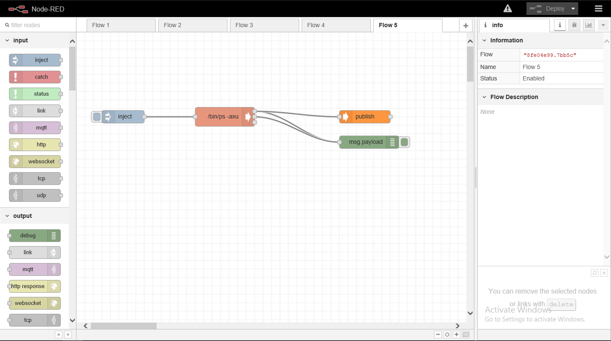
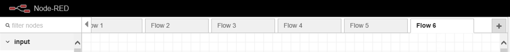
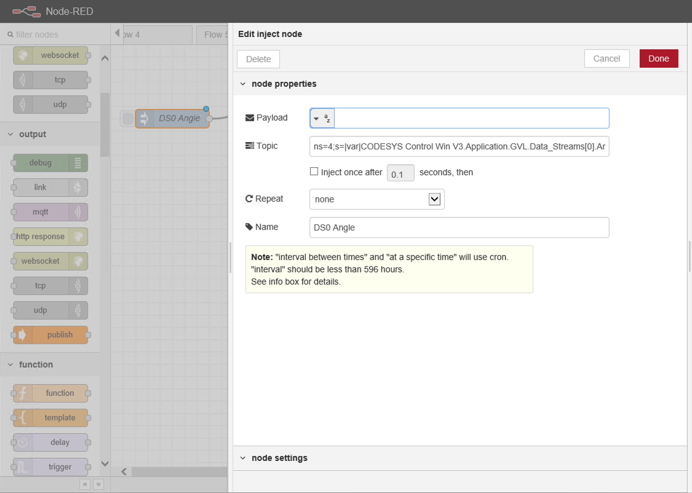
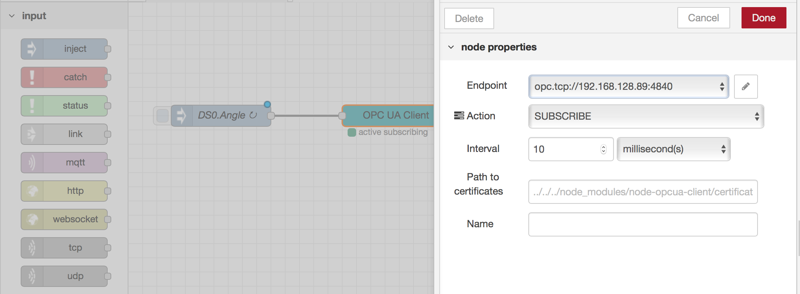
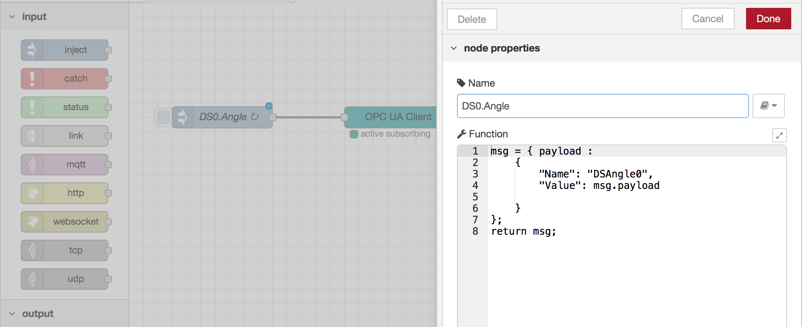
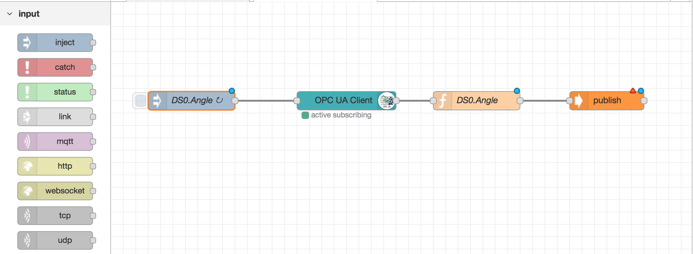

# MFG303 - Enable your Smart Factory with the AWS Industrial IoT Reference Solution

## Overview
This workshop will walk you through connecting industrial devices (PLCs Data) in your simulated factory environment to the AWS Cloud.

The workshop will walk you through the following steps:
1. Setup Greengrass as a Gateway
2. Deploy a Lambda Function with Node Red to act as the data concentrator.
3. Create and Setup the PLC Simulator
4. Configure Node Red to talk between the PLC Simulator and Greengrass

## Pre Requisites.
To complete this workshop you will need an AWS Account and Microsoft RDP Client installed on your PC and a Web Browser of course :-).

To ensure the workshop is successful we suggest that you use the **US-EAST-1** region for all AWS Services and tasks.


## Setting up the Environment.
This section will walk you through setting up the workshop environment.

To setup the environment for this workshop you will need to download the following [CloudFormation Template](cfn-templates/mfg303-cfn.yaml).

This template will build a basic VPC with Security Groups and the required IAM Policies with an EC2 instance which will host Greengrass.

1. Log into the AWS Console and select **CloudFormation** from the Services menu.
2. Click **Create Stack**
3. Choose to ***Upload a template to Amazon S3*** and click Next.
4. Name the Stack: **mfg303**
5. Enter a Username and Password for C9User and C9Passwd respectively, these will be the credentials you use to log into the Cloud9 interface.
6. Select the EC2 Key Pair you would like to use.
7. The default Instance Type of t2.micro can be left as default.
8. Click Next & Next
9. Tick the "I acknowledge that AWS CloudFormation might create IAM resources." box and click **Create**

The required resources will now be created for you, once completed successfully you can move onto the next step.

> To help you in future steps of the workshop I suggest you take note (copy to a text file) of the value of **C9IdeURL** in the output of CloudFormation.

## Configuring Greengrass
The following steps will walk you through configuring Node Red on Greengrass.

### Creating a Greengrass Group.
Firstly lets setup the Greengrass Group.

Make sure you are in the US-EAST-1 region.

1. From the AWS Console select the **IoT Core** service.

If you have never used IoT core before, click “Get started”.

2. On the left hand menu select **Greengrass**.
3. Within the main window under "Define a Greengrass Group" click "Get Started".
4. Click "Use easy creation"
5. Name your GG Group **PLCGateways**, click Next
6. Accept the default name for the Core and Click Next.
7. Click "Create Group and Core"
8. Click on “Download the resources as tar.gz” and store the downloaded files anywhere on your local hard disk.

> Typically, it is required to download the Greengrass release you want to use for the chip architecture of the device you are using. In this case, we can skip this step as we have already installed Greengrass on the EC2 instance via the CloudFormation template.

9. Click “Finish” at the bottom of the screen.

Within IAM create a new Role for Greengrass called **Greengrass_ServiceRole** which has the following policies attached AmazonS3FullAccess, CloudWatchLogsFullAccess, AWSGreengrassResourceAccessRolePolicy.

### Configuring the Greengrass Device.

1. From your Web Browser open a new tab or Window and browse to the Cloud9 URL which is referenced in the Outputs from the CloudFormation template **C9IdeUrl**.
2. Depending on your Web Browser accept/acknowledge the security warning around the website.
3. When you get the credential dialog box, enter the Username and Password you used when deploying the CloudFormation template.
4. From the Cloud9 IDE, click **File** > **Upload Local Files...** and select the tar.gz file that you downloaded from the Greengrass setup step.
5. From the Cloud9 IDE terminal window (bottom of the page), run the below command to extract the files.

```bash
sudo tar -xzvf ~/*-setup.tar.gz -C /greengrass
```
6. Next lets Start Greengrass with the below command.

```bash
sudo /greengrass/ggc/core/greengrassd start
```

Greengrass is now running

### Create a new Lambda Function.
Now we will configure the Node Red Lamdba Function.

1. From the Cloud9 Terminal run the following commend to extract the code.

```bash
tar -xvf nodeRedLambda.tar -C nodeRedLambda
cd nodeRedLambda
```
2. Edit package.json and add the following lines for the additional Node modules.

```json
"node-red-dashboard": "^2.11.0",
"node-red-contrib-modbus": "^4.1.1",
"node-red-contrib-opcua": "^0.2.32",
"node-opcua": "^0.5.1"
```
3. Once added and saved, run the below commands to build the function.

```bash
npm install
zip -r nodeRedLambda.zip ./*
```
4. Setup up your awscli credentials on the Cloud9 instance.
5. Then upload the nodeRedLambda.zip file to S3 bucket created as part of the CloudFormation template.

> HINT: aws s3 cp nodeRedLamdba.zip s3://....

6. From the AWS Console create a new Lambda function from scratch called **nodeRedFunction** with a Node.js 6.10 runtime. Choose "Create a new role from one or more templates" with a role name of nodeRedRole.
7. In the Lambda function window under **Function Code** choose to Upload the Function via a S3 and provide the S3 URL from step 5.
8. From the action menu select "Publish new version", type First version and then choose Publish. Select Create alias with a name of **GG_nodeRedFunction** with a version of 1.
9. From the IoT Services menu select the PLCGateways group under the Greengrass > Groups menu. Then select Add Lambda from the Lambdas menu.
10. Choose "Use existing Lambda" and select nodeRed and then select the Alias you created followed by Finished.
11. Once created click on **...** on the Lambda function and select Edit configuration.
12. Set the Memory limit to 250M and for the Lambda Lifecycle choose long-lived.

> Make sure you click update.

13. Go back to the Greengrass group menu and choose Subscriptions. Click Add Subscription, setting the Source as the nodeRed Lambda function and the Target as the IoT Cloud.
14. Click next and set **#** as the Topic Filter. Once done click Finish.
15. From the Resources side menu, click "Add a Local Resource". Name the resource nodeRed with type volume. Source path and Destination path = /nodered. Set Automatically add OS group permissions of the Linux group that owns the resource, select the nodeRed Lambda function with Read and Write and then click Save.
16. Create a new ML resource select the uploaded file from S3 (use the bucket from the cfn template) with a local path: /flows, upload the [myflow.json.zip](src/myflow.json.zip) to the bucket.
17. Click the Settings menu and click on Add Role for Group Role and select the Greengrass_ServiceRole followed by Save.
18. Finally under the Action menu for the Group, click Deploy using Automatic Detection and Grant Permissions.

> If the account previously has not been used with AWS Greengrass, the deployment can potentially fail because AWS Greengrass cannot assume the service role required to execute the deployment.

Via the Cloud9 terminal and ensuring your awscli credentials are configured, run the below commands.

```bash
gg_service_arn=$(aws iam get-role --role-name Greengrass_ServiceRole --query Role.Arn)
[ec2-user@ip-192-168-128-85 ~]$ aws greengrass associate-service-role-to-account --role-arn ${gg_service_arn//\"/}
```
Once associated re-run the Deploy.

## Setting up the PLC Simulator.
The following section will walk you through setting up the PLC Simulator host.

1. From the AWS Console go to EC2.
2. Click on "Launch Instance" and search for the following AMI within the community.

MFG303 Bedrock Automation - ami-07a329552c30a599f

3. Click Next and Select t2.xlarge as the instance type followed by "Configure Instance Details"
4. Select the VPC and Subnet for the instance which was created as part of the CloudFormation template and where the GG EC2 instance is residing.
5. Click Next on the Storage and add a Name Tag called "PLC Windows."
6. On the Security Group, select the security group which has a description of "Windows PLC SG"
7. Click Review and Launch and then Launch.

Once Launched, take note of the Public DNS IP and using your RDP client, connect to it.

The Username and Password to connect to the instance is provide on screen.

8. When the RDP Window launches, click Yes on the "Network Discovery" window if prompted.
9. In Windows Security disable/turn off the Windows Firewall.

Using the Windows command line or via your preferred method make a note of the Windows IP address, it should start with 192.168.128.

## Open Bedrock IDE.
We will now configure the Bedrock PLC simulator to start sending messages.

1. Right click on the Windows Task Tray Icon and right click on the PLC Icon and "Start the PLC".

Make sure it is now showing a running state.

2. Double click on Bedrock IDE icon on the desktop to start the simulator.
3. Click File > Open and select the file DataStreams to load the Project.
4. Click on the **Build** icon.
5. Click on the **Login** icon to start the simulator sending messages.

## Configuring Node Red.
We will now configure Node Red to communication between the PLC which is sending OPC UA messages to Greengrass which will then send the messages to the AWS Cloud via MQTT.

Via your Web Browser navigate http://<EC2 External IP>:1880/red/ replace <EC2 External IP> with the External DNS name of the EC2 GG instance.

Once the Node Red interface has loaded you will be presented with a page similar to below.



To test we have connectivity from Node Red to the AWS Cloud. From a new browser tab or go back to your AWS Console tab if you left it open.

- Go to IoT Core and Act.
- Subscribe to #
- From the Flow 5 tab, click on the left square next to Inject and you should see a message appear in IoT.

Next we are going to configure Node Red to listen to the OPC Server.

1. Create a new Flow tab in Node Red.



2. From the left hand menu drag on an "inject" object and copy in the Topic string as per the screenshot, clicking Done once completed.


3. Next drag on a opc-ua-client object, link it to the inject object. Double click it and define the endpoint using the PLC Windows server IP, click Done.


4. Next drag on a function, link it to the opc-ua client object and add the code as defined in the image below.


5. Finally drag on a publish command and link it to the function. Your flow should be similar to that of the one in the screenshot.


Now click **Deploy** in the top right hand of the Node Red window and then click on the inject objects button.

The Node Red flow will now be sending data from the PLC to AWS IoT. If you go back to your AWS Console IoT Test windows where you have subscribed to **#** you will see the messages flowing in.

## Additional Tasks (Advanced)

Now that you have a flow running, you can repeat the above steps to define flows for the Sine variable and for the other 2 Data Streams (1 & 2).

In total you could have 6 Flows defined.

Make sure when repeating the steps that you change the variables and the topic string to match.

You can also now configure AWS IoT Analytics to inject the data and visualise it.

Good Luck.
