# MFG303 - Enable your Smart Factory with the AWS Industrial IoT Reference Solution

## Overview
This workshop will walk you through connecting industrial devices (a simulated PLC) to the AWS Cloud using Node Red running as a Lambda function on AWS Greengrass.

The workshop will walk you through the following steps:
1. Setting up Greengrass as a Gateway
2. Deploying a Lambda Function with Node Red to act as the data concentrator.
3. Setting up the PLC Simulator
4. Configuring Node Red to talk between the PLC Simulator and Greengrass
5. Viewing the Data from the PLC in AWS IoT.

Below is a high level architecture of what we will be building today.
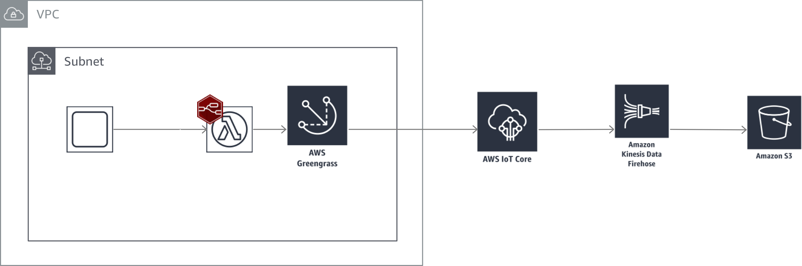

## Pre Requisites.
To complete this workshop you will need an AWS Account with Administration privileges and the Microsoft RDP Client installed on your PC and a Web Browser of course :-).

To ensure the workshop is successful we suggest that you use the **US-EAST-1** region for all AWS Services and tasks.

## Setting up the Workshop Environment.
This section will walk you through setting up the workshop environment.

To setup the environment for this workshop you just need to click on the following link to launch the [CloudFormation Template](https://us-east-1.console.aws.amazon.com/cloudformation/home?region=us-east-1#/stacks/create/review?templateURL=https://s3.amazonaws.com/reinvent2018-mfg303/mfg303-cfn.yaml&stackName=mfg303) into your AWS Account.

If you are not already logged into your AWS Console you will need to log in with the AWS Account Credentials which you will want to use for this workshop.

The CloudFormation template will build a basic VPC with Security Groups and the required IAM Policies with an EC2 instance which will host Greengrass on it.

When you click the link you will be taken to the CloudFormation Services page, below are the steps you will need to complete for the Template to deploy.

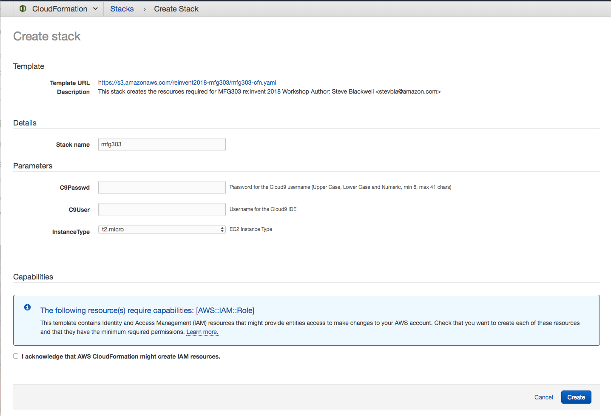

1. Enter a Username and Password for C9User and C9Passwd respectively, these will be the credentials you will use to log into the Cloud9 interface later in the workshop.
2. The default Instance Type of t2.micro can be left as default.
3. Click Next & Next
4. Tick the "I acknowledge that AWS CloudFormation might create IAM resources." box and click **Create**

The required resources will now be created for you, once completed successfully you can move onto the next step. It will take around 10 mins for the template to finish.

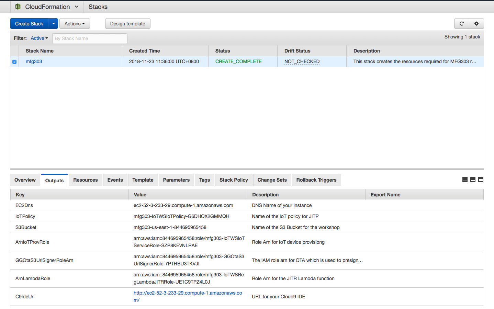

Take a note of the value of **C9IdeURL** in the Output tab of CloudFormation as you will need later in the workshop.

## Configuring Greengrass
Next we will walk you through configuring Node Red on Greengrass.

### Creating a Greengrass Group.
Firstly lets setup the Greengrass Group within the AWS Console.

Make sure you are in the **US-EAST-1** region.

1. From the AWS Console select the **IoT Core** service.

If you have never used IoT Core before, click “Get started”.

2. On the left hand menu select **Greengrass**.
3. Within the main window under "Define a Greengrass Group" click "Get Started".
4. Click "Use easy creation"
5. Name your GG Group **PLCGateway**, click Next
6. Accept the default name for the Core and Click Next.
7. Click "Create Group and Core"
8. Click on “Download the resources as tar.gz” and store the downloaded files anywhere on your local hard disk where you can find it later.

> Note: normally you should download the Greengrass release you want to use for the chip architecture of the device you are using. In case of this workshop, we can skip this step as we have already installed Greengrass on the EC2 instance via the CloudFormation template.

9. Make sure you Click “Finish” at the bottom of the page.

Within IAM create a new Role for Greengrass called **Greengrass_ServiceRole** which has the following policies attached AmazonS3FullAccess, CloudWatchLogsFullAccess, AWSGreengrassResourceAccessRolePolicy.

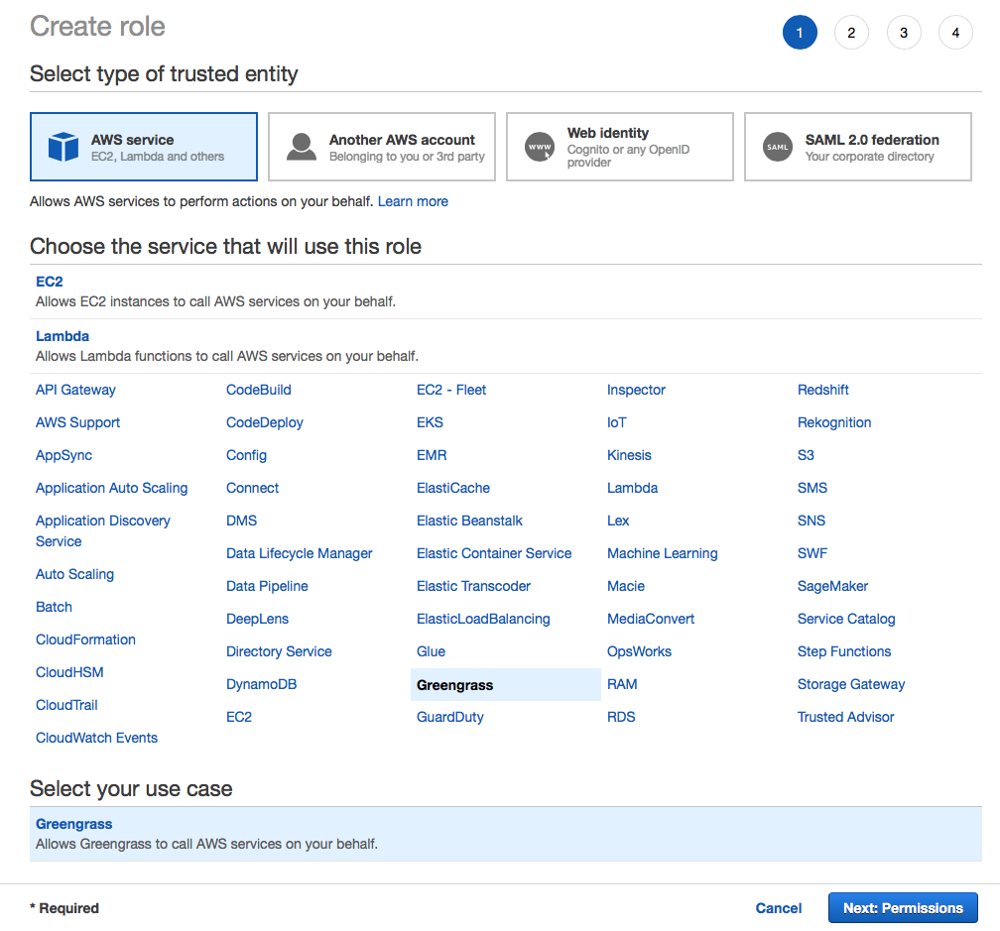

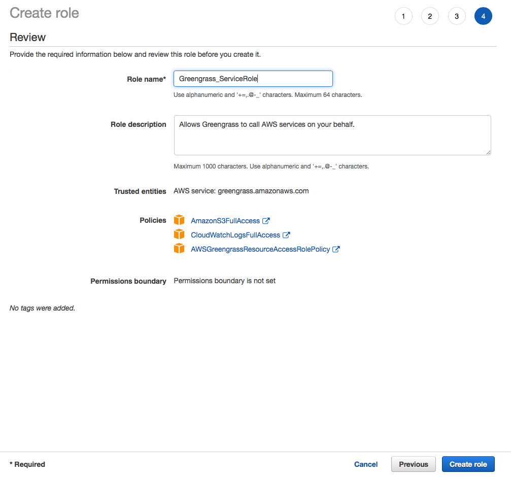

### Configuring the Greengrass Device.
Next we will need configure Greengrass on your EC2 instance.

1. From your Web Browser open a new tab or Window and browse to the Cloud9 URL which is referenced in the Outputs from the CloudFormation template **C9IdeUrl**.
2. Depending on your Web Browser accept/acknowledge the security warnings to allow you to browse the website.
3. When you get prompted with the credential dialog box, enter the Username and Password you used when deploying the CloudFormation template.

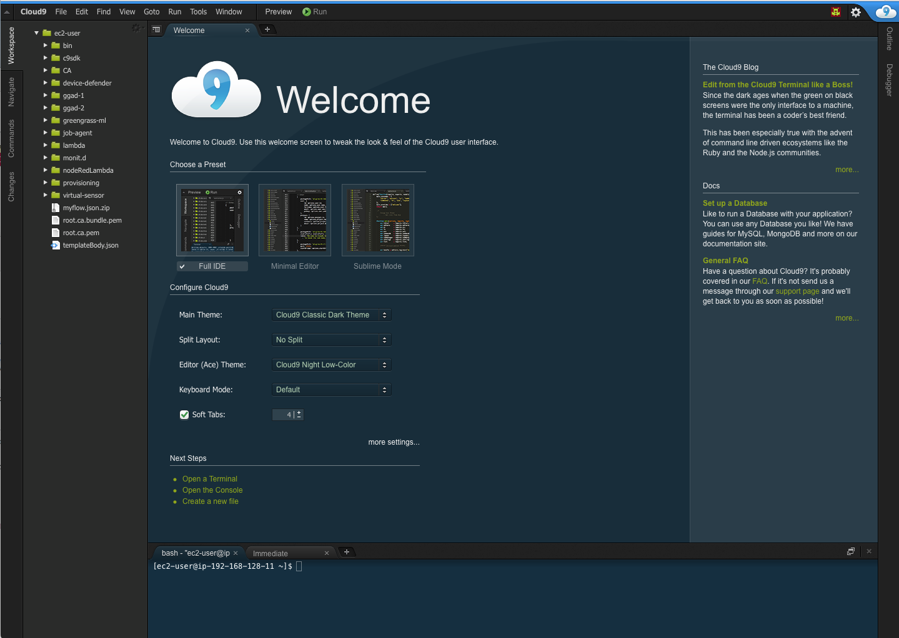

4. From the Cloud9 IDE, click **File** > **Upload Local Files...** and select the tar.gz file that you downloaded from the Greengrass setup step.

This will put the file into the home directory of the ec2-user, you should be able to see it within the file browser in the left hand windows of the Cloud9 interface.

5. From the Cloud9 IDE terminal window (bottom of the page), run the below command to extract the files.

```bash
sudo tar -xzvf ~/*-setup.tar.gz -C /greengrass
```
6. Next lets Start Greengrass with the below command.

```bash
sudo /greengrass/ggc/core/greengrassd start
```
Greengrass is now running and you should see output simular to that shown in the below screenshot.

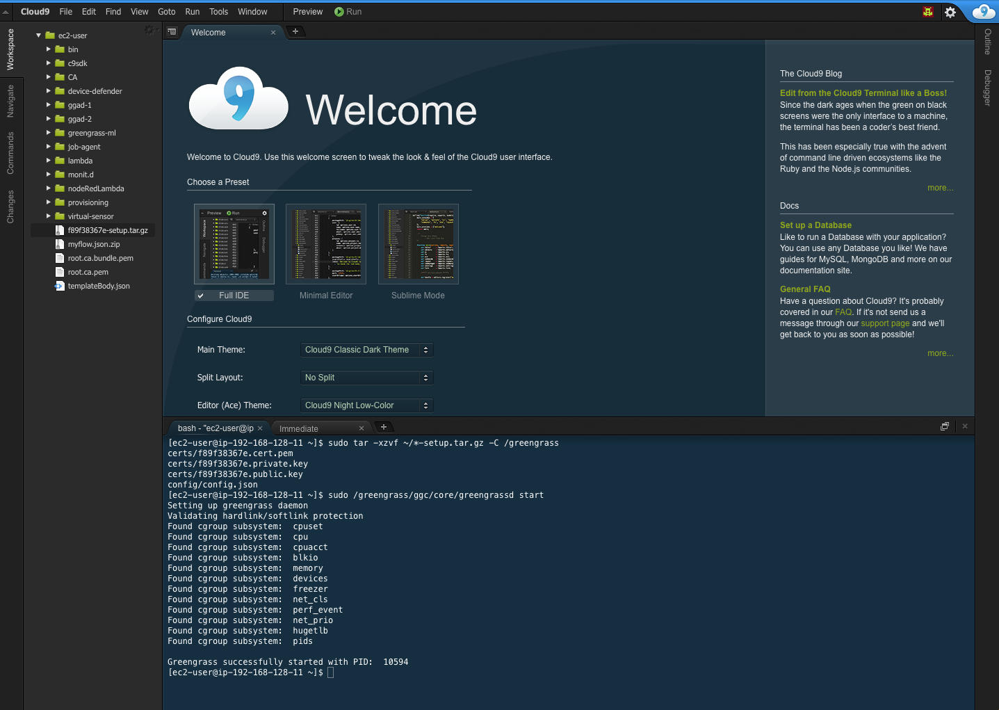

### Create a new Lambda Function.
Now we will configure the Node Red Lamdba Function which we will deploy onto Greengrass.

1. From the Cloud9 Terminal run the following commend to extract the code.

```bash
tar -xvf nodeRedLambda.tar -C nodeRedLambda
cd nodeRedLambda
```
You shoudl now have 2 files and a directory in the nodeRedLambda directory.
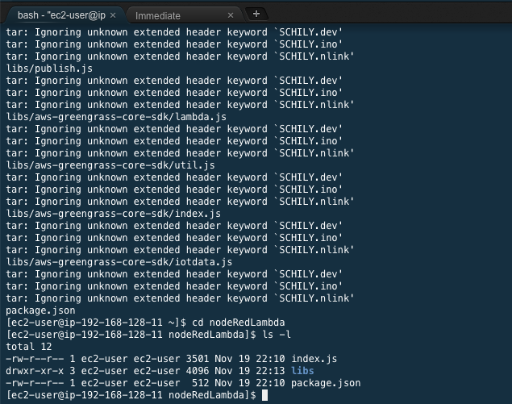

Next we will edit the packages.json file to add the additional Node Red modules we require. If in the future you would like to use other Industry Protocols, this is where you would add them to build it into the Node Red Lamdba function.

2. Edit package.json file in the nodeRed Lambda directory and add the following lines for the additional Node modules. You can do this via the Cloud9 interface, just double click the packages.json file on the left hand window and it will open up in the top main window.

```json
"node-red-dashboard": "^2.11.0",
"node-red-contrib-modbus": "^4.1.1",
"node-red-contrib-opcua": "^0.2.32",
"node-opcua": "^0.5.1"
```
Make sure you add a **,** to the end of the request line after adding in the above lines.

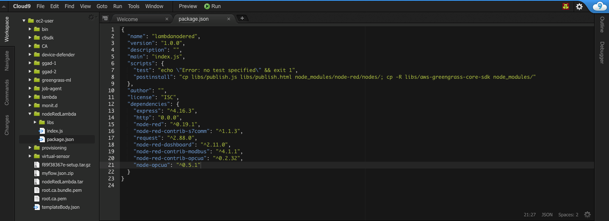

3. Once added and saved, run the below commands from the nodeRedLambda directory to build the function.

```bash
nvm install 6.10
npm install
```
If the build was successful you should see an output simular to the below.

```bash
> lambdanodered@1.0.0 postinstall /home/ec2-user/nodeRedLambda
> cp libs/publish.js libs/publish.html node_modules/node-red/nodes/; cp -R libs/aws-greengrass-core-sdk node_modules/

npm WARN enoent ENOENT: no such file or directory, open '/home/ec2-user/nodeRedLambda/node_modules/aws-greengrass-core-sdk/package.json'
npm WARN lambdanodered@1.0.0 No description
npm WARN lambdanodered@1.0.0 No repository field.
```

Once successful zip the files up using the below command.

```bash
zip -r ../nodeRedLambda.zip ./*
cd
```
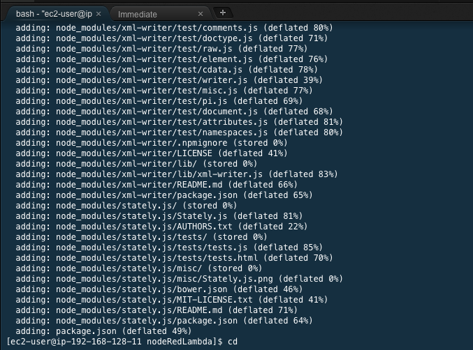

4. Setup up your awscli credentials on the Cloud9 instance using the aws configure command.
```bash
$ aws configure
```
5. Then upload the nodeRedLambda.zip file to S3 bucket created as part of the CloudFormation template.

> HINT: aws s3 cp nodeRedLambda.zip s3://mfg303-us-east-1-ACCOUNTID/

6. From the AWS Console create a new Lambda function from scratch called **nodeRedFunction** with a Node.js 6.10 runtime. Choose "Create a new role from one or more templates" with a role name of nodeRedRole. Click "Create function" to create the function.

> If this is the first time you have created a Lambda function, just click on "Create a function".

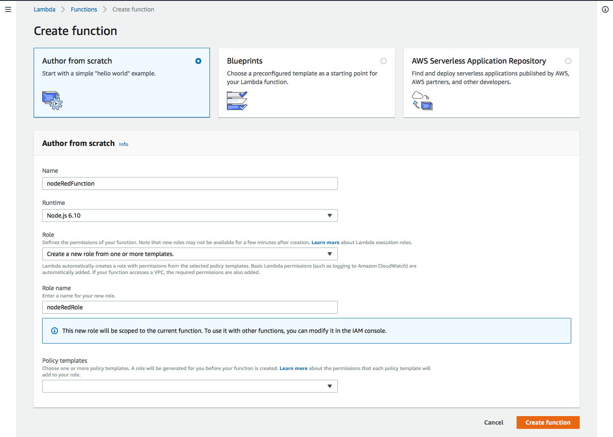

7. In the Lambda function window under **Function Code** choose to Upload the Function via a S3 and provide the S3 URL from step 5. Make sure you click "Save" to upload the zip file.

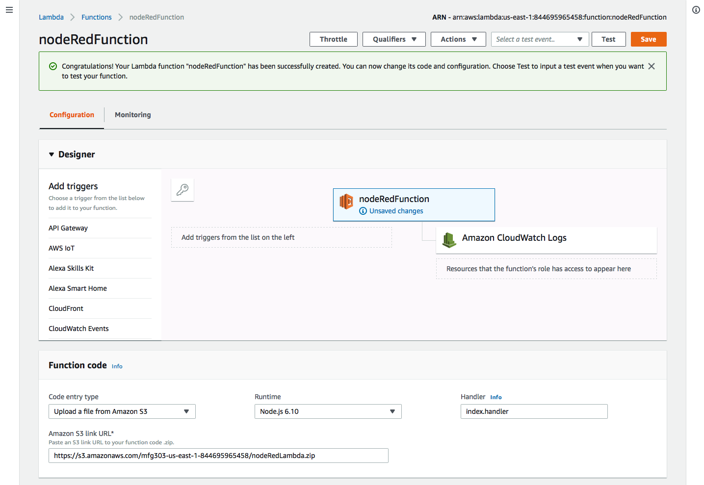

8. From the action menu select "Publish new version", type "First Version" and then choose Publish. Select Create alias with a name of **GG_nodeRedFunction** with a version of 1.
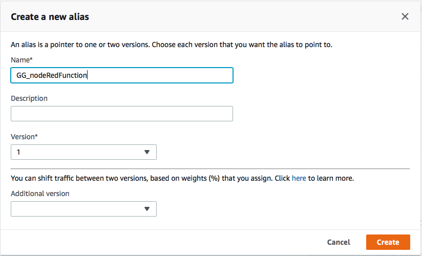

9. From the IoT Services menu select the PLCGateway group under the Greengrass > Groups menu. Then select Add Lambda/Add your first Lambda from the Lambdas menu.
10. Choose "Use existing Lambda" and select nodeRedFunction and then select the Alias you created followed by Finished.

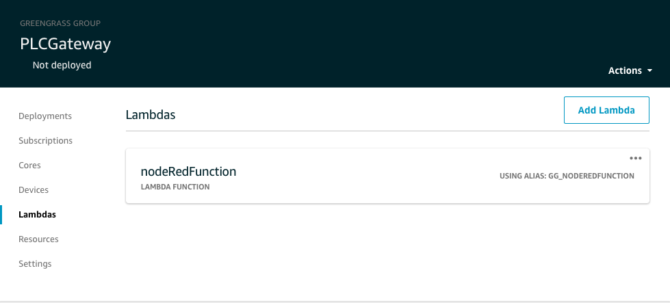

11. Once created click on **...** on the Lambda function and select Edit configuration.
12. Set the Memory limit to 250M and for the Lambda Lifecycle choose long-lived. Make sure you click Update at the bottom of the page.
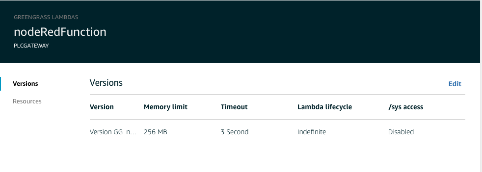

13. Go back to the Greengrass group menu and choose Subscriptions. Click Add Subscription, setting the Source as the nodeRed Lambda function and the Target as the IoT Cloud.
14. Click next and set **#** as the Topic Filter. Once done click Finish.


15. From the Resources side menu, click "Add a Local Resource". Name the resource nodeRed with type volume. Source path and Destination path = /nodered. Set Automatically add OS group permissions of the Linux group that owns the resource, select the nodeRedFunction Lambda function with Read and Write and then click Save.
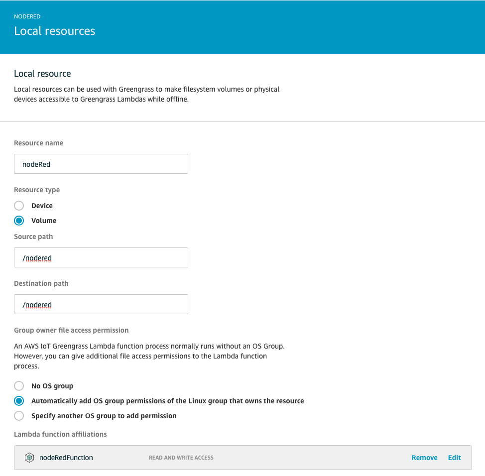

16. Upload the [myflow.json.zip](src/myflow.json.zip) to the S3 bucket created by CloudFormation template. Then create a new ML resource select the uploaded file from S3 (use the bucket from the cfn template) with a local path: /flows and select the nodeRedLambda function with "Read and write access" permissions.
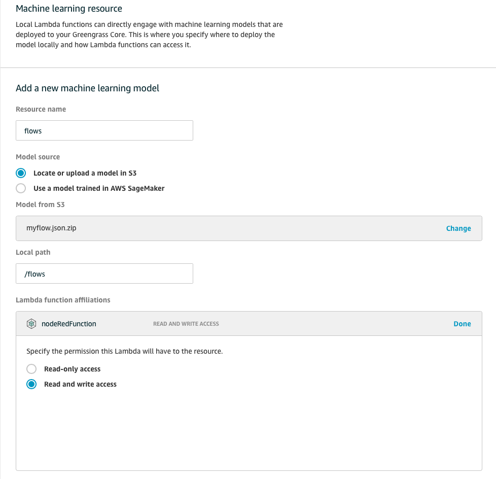

17. Click the Settings menu and click on Add Role for Group Role and select the Greengrass_ServiceRole followed by Save.
18. Finally under the Action menu for the Group, click Deploy using Automatic Detection and Grant Permissions.

If the account previously has not been used with AWS Greengrass, the deployment can potentially fail because AWS Greengrass cannot assume the service role required to execute the deployment.

To fix this via the Cloud9 terminal and ensuring your awscli credentials are configured, run the below commands.

```bash
gg_service_arn=$(aws iam get-role --role-name Greengrass_ServiceRole --query Role.Arn)
aws greengrass associate-service-role-to-account --role-arn ${gg_service_arn//\"/}
```
Once associated re-run the Deploy action.

Once the Lambda Function has successfully deployed you will see a message as per below.

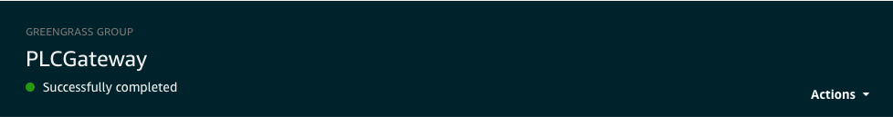


## Setting up the PLC Simulator.
Now we will create and setup the PLC Simulator.

1. From the AWS Console go to EC2.
2. Click on "Launch Instance" / "Launch a Virtual Machine" and search for the following AMI within the community.

MFG303 Bedrock Automation - ami-07a329552c30a599f

3. Click Next and Select **t2.xlarge** as the instance type followed by "Configure Instance Details"
4. Select the VPC and Subnet for the instance which was created as part of the CloudFormation template and where the GG EC2 instance is residing.
> Hint: The VPC will be called "VPC 192.168.128.0/24"

5. Click Next on the Storage and add a Name Tag called "PLC Windows."
6. On the Security Group, select the security group which has a description of "Windows PLC SG"
7. Click Review and Launch and then Launch.
> You can either select a key pair you already have in your account or proceed without.

It will take a couple of minutes for the instances to launch.

Once Launched, take note of the Public DNS and using your RDP client on your laptop, connect to it.

The Username and Password to connect to the instance is provide on screen.

8. When the RDP Window launches, click Yes on the "Network Discovery" window if prompted.
9. In Windows Security disable/turn off the Windows Firewall.

Using the Windows command line, AWS Console or via your preferred method make a note of the Windows IP Private address, it should start with 192.168.128.

### Open Bedrock IDE.
We will now configure the Bedrock PLC simulator to start sending messages.

1. Right click on the Windows Task Tray Icon and right click on the CODESYS Icon and "Start PLC", if it is not already running.

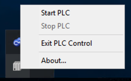

2. Double click on "Bedrock IDE V1.8" icon on the desktop to start the simulator.

3. Click File > Open and select the file DataStreams to load the Project.
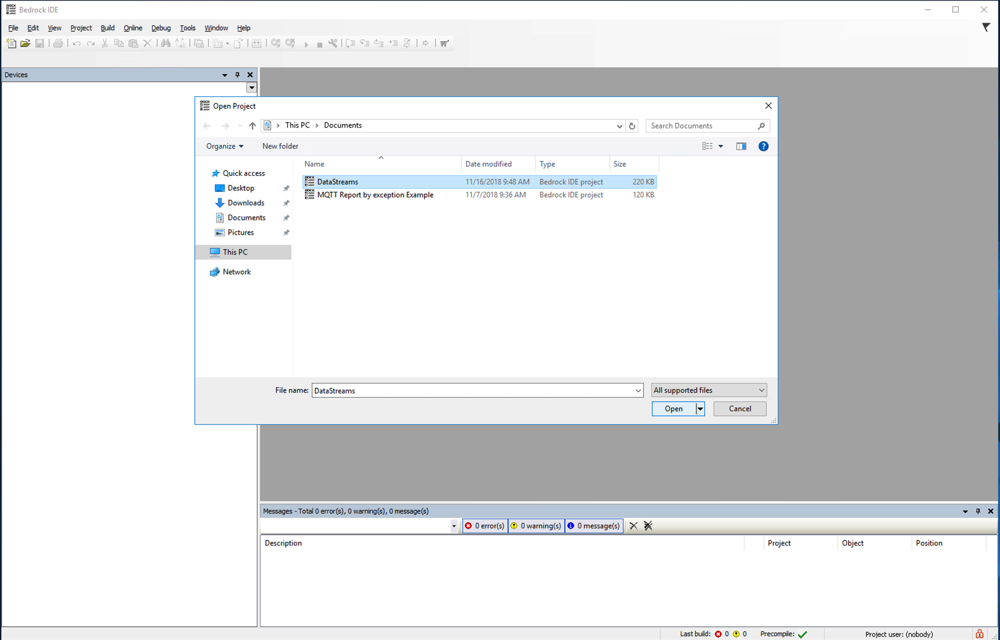

4. Click on the **Build** icon.
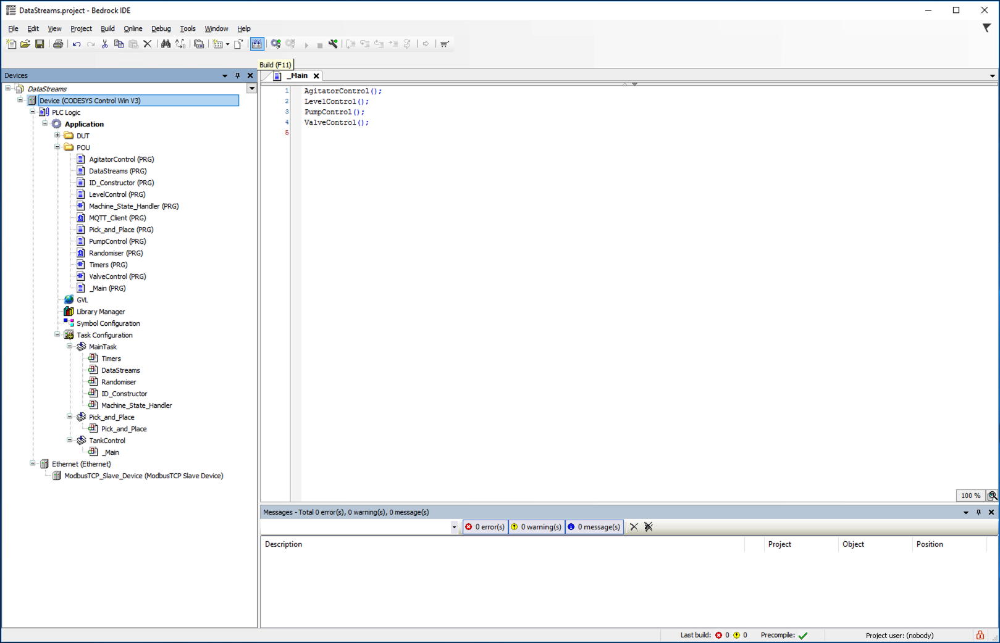
5. Double Click on the Device tree item in the left hand window and make sure that the EC2 instance is selected in the drop down list.

6. Click on the **Login** icon to start the simulator sending messages.


In the bottom dialog tool bar of the Bedrock software you should now see a Green Box that says **RUN**.

### Configuring Node Red.
We will now configure Node Red to communication between the PLC which is sending OPC UA messages to Greengrass, which will then send the messages to the AWS IoT via MQTT.

Via your Web Browser navigate http://EC2 External IP:1880/red/ replace <EC2 External IP> with the External DNS name of the EC2 GG instance.

Once the Node Red interface has loaded you will be presented with a page similar to below.


To test we have connectivity from Node Red to the AWS Cloud. From a new browser tab or go back to your AWS Console tab if you left it open.

- Go to IoT Core and click Test.
- Subscribe to #
- From the Test Flow tab, click on the left square next to Inject and you should see a message appear in IoT.

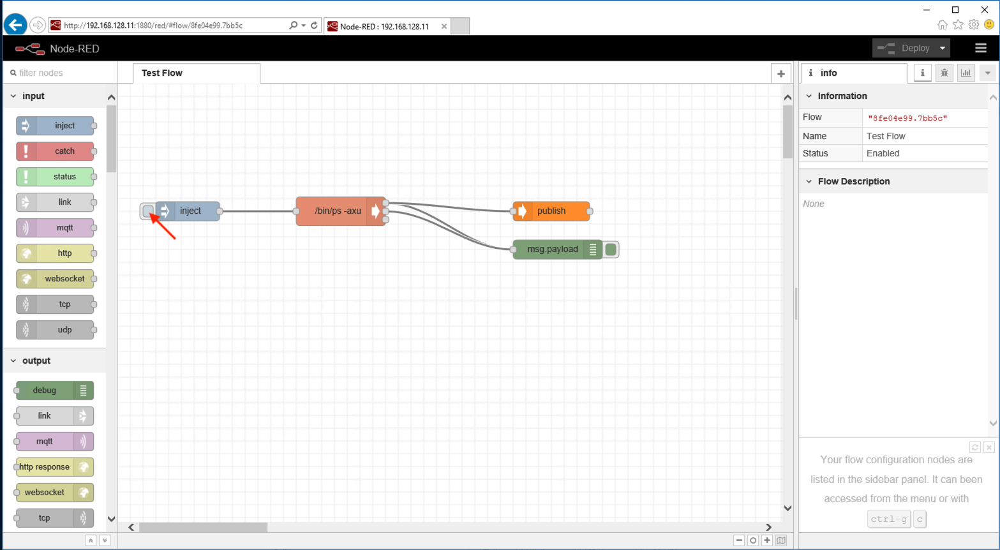

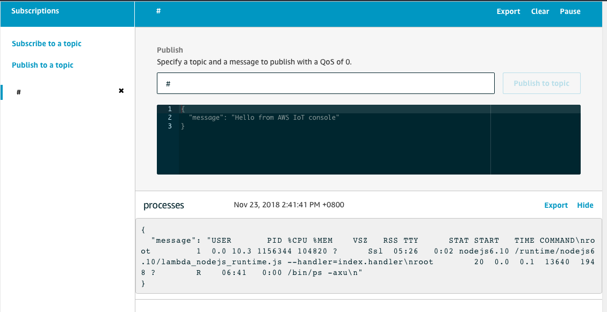

Now we are going to configure Node Red to listen to the OPC Server.

1. Create a new Flow tab in Node Red.


2. From the left hand menu drag on an "inject" object and copy in the Topic string (ns=4;s=|var|CODESYS Control Win V3.Application.GVL.Data_Streams[0].Angle) as per the screenshot, clicking Done once completed.


3. Next drag on a opc-ua-client object, link it to the inject object. Double click it and define the endpoint using the PLC Windows server IP, click Done.


4. Next drag on a function, link it to the opc-ua client object and add the code as defined in the image below.
```JSON
msg = { payload :
  {
      "Name": "DSAngle0",
      "Value": msg.payload
  }
};
return msg;
```


5. Finally drag on a publish command and link it to the function. Your flow should be similar to that of the one in the screenshot.


Now click **Deploy** in the top right hand of the Node Red window and then click on the inject object button.

The Node Red flow will now be sending data from the PLC to AWS IoT. If you go back to your AWS Console IoT Test windows where you have subscribed to **#** you will see the messages flowing in.

6. If you want to create different topic for each Data Stream then double click on the **publish** item and define a topic for example plc/ds0.
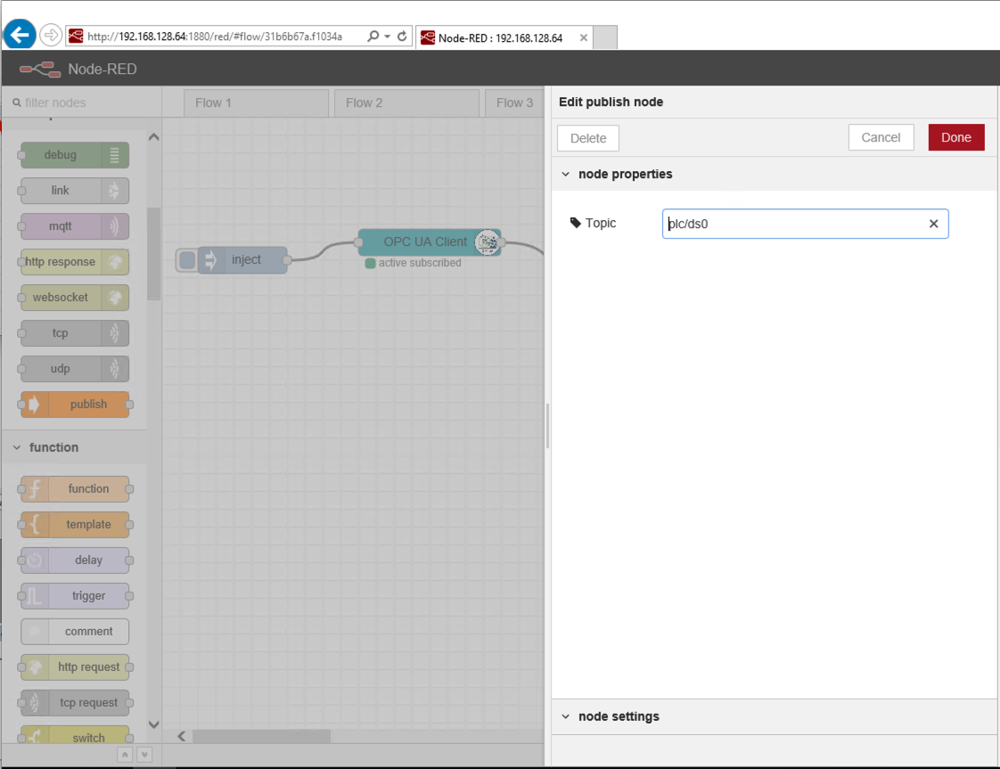

7. Now Deploy the flow and click on inject. You will now see in the AWS IoT that the data is coming across on a topic.
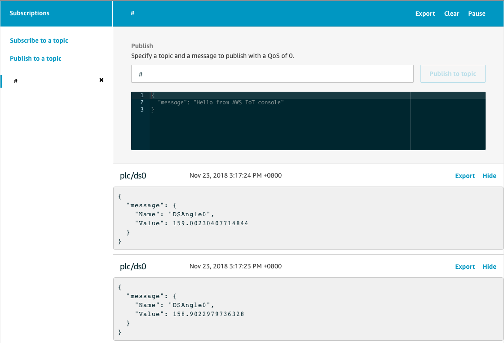


### Configuring the other Data Streams from the PLC

Now that you have a flow running, you can repeat the above steps to define flows for the Sine (ns=4;s=|var|CODESYS Control Win V3.Application.GVL.Data_Streams[0].Sine) variable and for the other 2 Data Streams (1 & 2).

In total you should have 6 Flows defined as shown below, publishing to 3 topics (plc/ds0, plc/ds1 & plc/ds2).
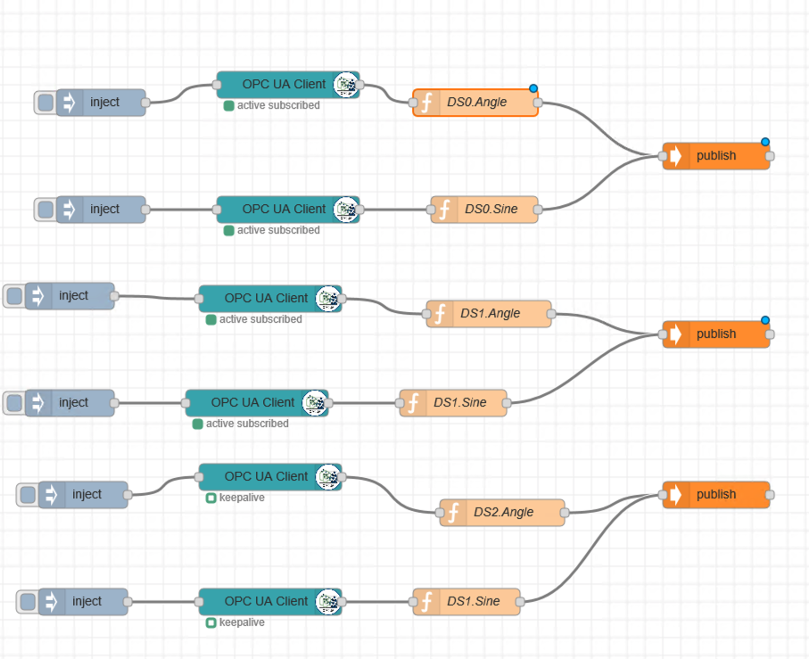

Make sure when repeating the steps that you change the variables and the topic string to match.

## Additional Tasks (Advanced)

If you have time you can now config AWS IoT Analytics as a channel and datastore, then visualise the data in Quicksight.

Additionally you could config Node Red to communicate to the PLC via Modbus.

Good Luck.

## Final Note.

Please make sure that you clear down/delete the resources created in this workshop once you are done. Make sure you delete the resources created manually before you delete the cloudformation template.
